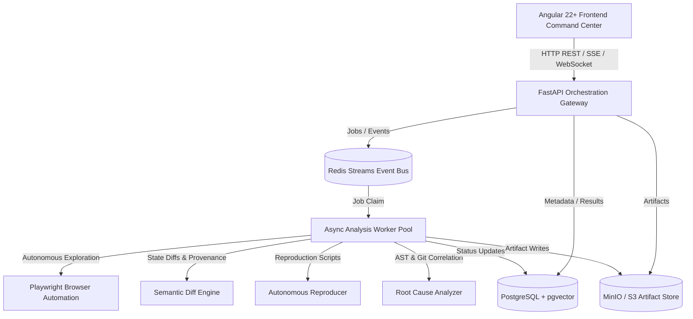

# RETRACE Architecture Blueprint

## 1. System Overview

**RETRACE** is an autonomous, evidence-driven regression investigation platform. It explores two versions of a web application (Version A vs. Version B), identifies meaningful behavioral and API contract regressions, eliminates cosmetic noise, reproduces failures through isolated Playwright scripts, investigates root causes using source code AST diffs, and synthesizes engineering reports with full evidence provenance.



---

## 2. Core Service Boundaries

### Frontend (`apps/frontend/`)
* **Role:** Single-page command center for configuring analysis runs, inspecting live workflows, viewing dual-pane visual replays, and exploring interactive Monaco AST diffs.
* **Boundary:** Strictly client-side. Communicates exclusively with `apps/api/` via HTTP/JSON contracts. Zero direct database or filesystem access.

### API Gateway (`apps/api/`)
* **Role:** Authentication, request validation, project management, run lifecycle triggering, health & readiness probes, and telemetry.
* **Boundary:** Stateless REST API. Dispatches long-running exploration and analysis jobs to Redis Streams. Does not execute Playwright browsers in-process.

### Analysis Worker (`apps/worker/`)
* **Role:** Execution engine for browser automation (Playwright), state diff calculation, LLM reasoning agent invocation (LangGraph), reproduction verification, and report synthesis.
* **Boundary:** Scalable background process. Consumes jobs from Redis Streams, runs isolated tasks, and writes multi-modal artifacts to object storage.

### Shared Packages (`packages/`)
* `packages/domain/`: Pure domain entities, value objects, enums, and validation logic.
* `packages/config/`: Centralized Pydantic BaseSettings loading from environment variables.
* `packages/storage/`: Abstract `ArtifactStorage` with Local and S3/MinIO backends.
* `packages/db/`: SQLAlchemy declarative base, async session management, and health probes.
* `packages/redis_client/`: Async Redis connection pooling and health checks.
* `packages/logging/`: Structured contextual logging system.

---

## 3. Evidence & Provenance Model

RETRACE is an **evidence-first** system. AI reasoning is applied *only after* deterministic evidence is captured and diffed.

Every regression finding maintains strict provenance:
```text
Observation (vA vs vB)
   ↓
Deterministic Diff (DOM, A11y, HAR, Console, Performance)
   ↓
Candidate Anomaly Classification
   ↓
Autonomous Playwright Reproduction (Must fail on vB, pass on vA)
   ↓
Git Commit & AST Diff Correlation
   ↓
Verified Engineering Report
```
